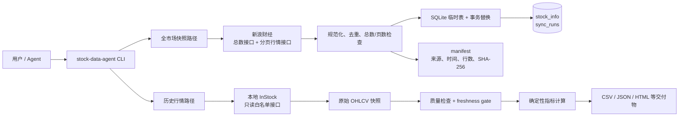

# 股票数据分析 Agent 接手包

[](LICENSE)

一套**不含任何选股策略**的股票数据工具。它主要干五件事：

1. 从公开行情接口同步真实的沪深北A股全市场名单与最新行情快照；
2. 检查数据服务活没活；
3. 检查数据是不是最新交易日的（不新鲜就拦住，不让下游发消息）；
4. 检查数据本身有没有毛病（缺字段、重复、负价格、OHLC 逻辑错乱）；
5. 算出通用技术指标，并留下一份可复查的 `manifest.json`。

基于开源项目 [myhhub/stock](https://github.com/myhhub/stock)（InStock）。

> 只做数据和确定性计算。不含私有策略、参数、候选清单、新闻分析、密钥，也不执行任何交易。

---

## 60秒跑出真实A股数据库

只想复现文章里“获取真实A股数据并形成全市场数据库”的读者，先跑这一段：

```bash
git clone https://github.com/147228/stock-data-agent-handover.git
cd stock-data-agent-handover
python3 -m venv .venv
source .venv/bin/activate
python -m pip install -e .

stock-data-agent sync-a-share-universe \
  --database data/a_share.db \
  --manifest outputs/a_share_universe_manifest.json
```

命令完成时会直接打印实际入库数。再用下面三条 SQL 验收：

```bash
sqlite3 data/a_share.db 'SELECT COUNT(*) FROM stock_info;'
sqlite3 data/a_share.db \
  'SELECT exchange,COUNT(*) FROM stock_info GROUP BY exchange ORDER BY exchange;'
sqlite3 data/a_share.db \
  'SELECT retrieved_at,row_count,pages_fetched FROM sync_runs ORDER BY id DESC LIMIT 1;'
```

股票数量会随上市、退市变化。文章实测时的4589只、仓库验收时的5532只都只是
特定时点快照；**永远以数据库查询结果为准，不要把某个数字写死。**

---

## 一、最快的用法：直接丢给 Agent

不用会写代码。开一个 Agent 对话框，把仓库地址和需求一起丢进去就行：


把下面这段复制给你的 Agent（TRAE Work / Claude Code / Codex 都行）：

```text
请阅读这个仓库：https://github.com/147228/stock-data-agent-handover
按顺序做四件事：

1. 读 README 和 docs/ 下的 7 篇文档，搞清楚这套工具有哪些命令、
   哪些边界不能碰（尤其是 docs/07-SECURITY-BOUNDARY.md）。
2. 在本地 clone 下来，建 venv，pip install -e '.[dev]'，跑 pytest，
   确认全部测试通过。
3. 用 examples/ohlcv_sample.csv 跑通 validate -> indicators -> report 三步，
   把 outputs/run-001/manifest.json 里的 freshness、row_count、input_sha256
   讲给我听。
4. 运行 stock-data-agent sync-a-share-universe，把真实沪深北A股全市场快照
   写入 data/a_share.db；完成后查询 stock_info 的行数、最新同步时间和前5行，
   并告诉我实际入库数量。数量必须来自数据库，不得照抄文档。

规矩：freshness 是 stale 或 unknown 时必须直接告诉我并停下，
不许自己补数据、不许猜、不许给买卖建议。
```

跑完这一遍就算入门。之后可以直接对话提问：

```text
用 stock-data-agent report 跑一下 data/today.csv，
告诉我：数据日期是哪天、freshness 是什么状态、质检有没有报错、
最新一天的 MACD 柱和量比分别是多少。
如果 freshness 不是 fresh，只报告问题，不要给我任何个股结论。
```

---

## 二、安装

需要 **Python 3.11+**。

```bash
git clone https://github.com/147228/stock-data-agent-handover.git
cd stock-data-agent-handover
python3 -m venv .venv
source .venv/bin/activate
python -m pip install -e '.[dev]'
pytest
```

当前版本 `pytest` 应输出 `16 passed`。装好后 `stock-data-agent` 命令即可用：

```bash
stock-data-agent --version     # 0.1.0
stock-data-agent --help
```

---

## 架构说明

这不是一个让大模型“凭记忆报股票”的项目。数据获取、完整性检查、落库和指标计算
都由确定性程序完成，Agent只负责调用工具、读取证据和解释结果。



| 层 | 作用 | 关键边界 |
|---|---|---|
| Agent / CLI | 接收任务、编排命令、解释结果 | 不心算指标，不猜缺失数据 |
| 新浪财经快照 | 获取沪深北A股名单和最新行情 | 公共接口可能限流或改字段，不是稳定官方合约 |
| InStock | 提供历史行情和本地缓存 | 默认只允许回环地址、GET和模块白名单 |
| 完整性与新鲜度 | 校验总数、页数、字段、日期 | 不完整、stale、unknown 一律阻断 |
| SQLite / outputs | 保存当前快照、同步审计和分析结果 | 数据库与行情文件受 `.gitignore` 保护，不上传GitHub |

`sync-a-share-universe` 不要求先部署 InStock：只安装本仓库即可形成全市场SQLite快照。
需要历史日K、指标或长期自动更新时，再接入 InStock 或其他获准的数据源。

---

## 三、六条命令

### ① `health` — 看服务活没活

```bash
stock-data-agent health --base-url http://127.0.0.1:9988
```

**注意：这只证明网页能打开，不证明数据是今天的。** 这是这套东西里最容易踩的坑——容器全绿、页面正常，但数据还停在三天前。判断数据新不新鲜，要看下面的 `validate --check-freshness`。

服务不通时退出码为 `2`。

### ② `fetch-module` — 拉一份已批准的数据模块

先复制配置：

```bash
cp config.example.yaml config.yaml
```

`config.yaml` 各字段含义：

```yaml
instock:
  base_url: "http://127.0.0.1:9988"
  timeout_seconds: 10
  max_response_bytes: 20000000    # 超过这个大小直接拒收，防止拖垮内存
  allow_remote: false             # false = 只允许 127.0.0.1 / localhost / ::1
  allowed_modules: []             # 留空 = fetch-module 一律拒绝

analysis:
  timezone: "Asia/Shanghai"
  daily_ready_time: "17:45"       # 当天数据几点之后才算“应该有了”
  trading_calendar: null          # 交易日历 CSV 路径，见下方说明
```

`allowed_modules` 由所有者/运维填写已批准的只读模块名。**不要把私有模块名写进公开文档。**

```bash
stock-data-agent fetch-module \
  --config config.yaml \
  --module APPROVED_MODULE \
  --date 2026-07-21 \
  --output data/raw/module-2026-07-21.json
```

工具只发只读 GET、不跟随重定向、限制响应体大小、拒绝白名单外的模块，并在快照旁边写一份元数据文件（记录来源、时间、哈希）。

**不要绕过它直接连 MariaDB 拼 SQL。**

远程访问默认被拦：`remote InStock URL is blocked; use SSH tunnel or explicit allow_remote`。正确做法是开 SSH 隧道后仍然访问 `127.0.0.1`，而不是把 `allow_remote` 改成 `true`。

### ③ `validate` — 体检 CSV

输入 CSV 必须包含这 7 列：`code,date,open,high,low,close,volume`
可选列：`amount,turnover_rate,adj_factor,source`

```bash
stock-data-agent validate \
  --input examples/ohlcv_sample.csv \
  --output outputs/quality.json \
  --check-freshness \
  --now 2026-07-21T18:00:00+08:00
```

`--now` 用来固定“现在几点”，方便复现和写测试；日常使用可以不加，工具会用系统时间。

数据正常时的输出（节选）：

```json
{
  "ok": true,
  "row_count": 37,
  "symbol_count": 1,
  "actual_as_of": "2026-07-21",
  "missing_columns": [],
  "field_coverage": { "close": 100.0, "volume": 100.0, "amount": 100.0 },
  "duplicate_key_rows": 0,
  "invalid_ohlc_rows": 0,
  "negative_value_rows": 0,
  "non_monotonic_symbols": [],
  "freshness": {
    "status": "fresh",
    "actual_as_of": "2026-07-21",
    "expected_as_of": "2026-07-21",
    "calendar_quality": "weekday_only",
    "reason": "actual_as_of meets the expected daily date"
  },
  "errors": []
}
```

同一份数据，6 天后再跑一次：

```json
{
  "ok": false,
  "freshness": {
    "status": "stale",
    "actual_as_of": "2026-07-21",
    "expected_as_of": "2026-07-27",
    "reason": "data is behind by at least 6 calendar day(s)"
  },
  "errors": ["freshness gate failed: stale"]
}
```

此时退出码是 `2`，cron / systemd 会自动卡住下游任务。

**关于 `calendar_quality`：** 不配 `trading_calendar` 时是 `weekday_only`——只按周一到周五算，**不认识法定节假日**，所以长假后第一天容易误判。生产环境请提供一份 `date,is_open` 两列的 CSV：

```csv
date,is_open
2026-07-20,1
2026-07-21,1
2026-07-22,0
```

配上之后 `calendar_quality` 会变成 `exchange_calendar`，这才是可信的证据等级。

### ④ `indicators` — 算通用指标

```bash
stock-data-agent indicators \
  --input examples/ohlcv_sample.csv \
  --output outputs/indicators.csv
```

在原始列后面追加这些列：

```text
sma_5  sma_10  sma_20  ema_12  ema_26
macd  macd_signal  macd_hist
rsi_14  atr_14
volume_ma_5  volume_ratio_5
```

前若干行因为窗口不够会是空值，这是正常的，**不要拿空值当 0 用**。

它**不排序、不筛选、不推荐、不给买卖信号**——阈值和策略是使用者自己的事，不进这个仓库。

### ⑤ `report` — 一条命令跑完全套（推荐）

```bash
stock-data-agent report \
  --input examples/ohlcv_sample.csv \
  --output-dir outputs/run-001 \
  --now 2026-07-21T18:00:00+08:00
```

产出四个文件：

```text
outputs/run-001/
├── quality.json         # 完整质检结果
├── indicators.csv       # 全量指标
├── latest_snapshot.csv  # 每只票最新一行（日常看盘只看这个就够）
└── manifest.json        # 审计凭证
```

`manifest.json` 长这样——**这是整套东西里最该留档的文件**，有它才能回答“这个结论是基于哪天、哪份数据、哪个版本算出来的”：

```json
{
  "tool": "stock-data-agent",
  "version": "0.1.0",
  "run_time": "2026-07-21T18:02:11+08:00",
  "input": "examples/ohlcv_sample.csv",
  "input_sha256": "2b6d097122c83349e93a9d45ffb97dfec3ca5c98cedae80391bc7d5be0e496f3",
  "row_count": 37,
  "symbol_count": 1,
  "freshness": { "status": "fresh", "actual_as_of": "2026-07-21" },
  "quality_ok": true,
  "outputs": { "quality": "...", "indicators": "...", "latest_snapshot": "..." }
}
```

质检报错时默认不写 indicators（避免脏数据流下去）。确实要看中间结果时加 `--write-indicators-on-failure`。

### ⑥ `sync-a-share-universe` — 获取真实沪深北A股并写入SQLite

这条命令会分页读取公开行情接口，把当时可获得的全部沪深北A股基础信息和最新行情
原子写入SQLite。股票数量会随上市、退市而变化，**不要把4589或其他历史数字写死成
验收标准**；程序只接受不少于4000行的完整快照，并同时保存同步记录和内容哈希。

```bash
stock-data-agent sync-a-share-universe \
  --database data/a_share.db \
  --manifest outputs/a_share_universe_manifest.json
```

成功后可以直接验收：

```bash
sqlite3 data/a_share.db 'SELECT COUNT(*) FROM stock_info;'
sqlite3 data/a_share.db \
  'SELECT code,name,exchange,last_price,change_pct,retrieved_at FROM stock_info LIMIT 5;'
sqlite3 data/a_share.db \
  'SELECT retrieved_at,row_count,pages_fetched,records_sha256 FROM sync_runs ORDER BY id DESC LIMIT 1;'
```

`stock_info` 包含代码、名称、交易所、最新价、涨跌幅、成交量、成交额、换手率、
市盈率、市净率、总市值、流通市值、开高低收和同步时间。数据源是新浪财经公开行情
接口；该接口不是官方稳定合约，可能限流或变更，不能作为交易指令或唯一决策依据。

这一步建立的是全市场**基础信息与最新行情快照**。历史日K仍需从已部署的InStock或
其他经允许的数据源取得，再交给 `validate / indicators / report` 处理。

#### 如果行情接口频繁报错

先区分错误类型，不要让多个Agent同时反复重跑。当前命令已经内置浏览器
`User-Agent`、对 `429/500/502/503/504` 的3次退避重试、15秒超时、全量行数校验和
原子写库；抓到空页、少页或不足4000行时会失败，**不会用残缺数据覆盖上一次成功库**。

按下面顺序处理：

1. **超时、连接重置：** 把单次超时提高到30秒，等一分钟后只重跑一次。

   ```bash
   stock-data-agent sync-a-share-universe --timeout 30
   ```

2. **本机代理、证书或连接异常：** 我们实测中过一次代理干扰。仅在确认是代理问题时，
   临时绕过该域名；不要把关闭代理当成解决 `429` 限流的办法。

   ```bash
   HTTP_PROXY= HTTPS_PROXY= ALL_PROXY= \
   NO_PROXY=vip.stock.finance.sina.com.cn,localhost,127.0.0.1 \
   stock-data-agent sync-a-share-universe --timeout 30
   ```

3. **`429`、连续 `5xx`：** 停止并发，等待1—3分钟再试。生产环境只让一个定时任务
   负责同步，其他Agent读取同一个 `data/a_share.db`，不要每个任务各抓一遍。

4. **HTTP 200但返回空列表、`result:null` 或总数对不上：** 把它当上游失败，不要解释成
   “今天没有股票”。保留上一次成功数据库和失败日志，稍后重试。InStock链路过去采用过
   30秒超时、语义空响应重试，以及在可配置接口上把页大小提高到1000；新浪接口本身每页
   上限为100，不要强行改大。

5. **新浪持续不可用：** 可以切到已经部署的本地 InStock。优先读取同日
   `cn_stock_selection`；若它为空但 `cn_stock_spot` 正常，可将现货行情与最近10天内的
   基本面快照按股票代码合并，并分别记录 `market_as_of` 和 `fundamentals_as_of`。
   找不到近期基本面就停止，不能补零后伪装成完整数据。

6. **需要历史日K：** 使用 InStock 缓存，或按数据源许可单独接入 BaoStock 等历史行情源。
   新来源应写入独立原始快照/表，并记录 `source`、`as_of`、字段口径和行数；不要把不同
   来源静默拼成同一种数据。

可以把下面这段直接交给Agent：

```text
如果 sync-a-share-universe 失败：先读取真实错误和现有 sync_runs，不要并发重跑；
连接类错误用 --timeout 30 单次重试；429/5xx 等待1—3分钟；HTTP 200但空列表、
result:null、总数或页数不一致都按失败处理，不得覆盖上一次成功数据库。
若确认是代理问题，临时对 vip.stock.finance.sina.com.cn 绕过代理。
新浪持续不可用时，先征得我同意再切 InStock，并在结果里明确 source、market_as_of、
fundamentals_as_of、row_count 和限制；缺近期基本面就停，不许补零或猜测。
```

### 退出码

| 码 | 含义 | 建议动作 |
|---|---|---|
| `0` | 一切正常 | 放行下游 |
| `2` | 服务不通 / 质检失败 / freshness 为 stale 或 unknown | **拦截下游**，只发数据异常告警 |

在 cron 里直接串起来即可：

```bash
stock-data-agent report --config config.yaml \
  --input data/today.csv --output-dir outputs/$(date +%F) \
  && ./notify.sh outputs/$(date +%F)/latest_snapshot.csv \
  || ./alert.sh "股票数据异常，今日不发送任何提醒"
```

---

## 四、三条不能破的规矩

### 1. 数据不新鲜就不许往下走（freshness gate）

```text
服务健康 + 数据到了最近应有的交易日 + 刷新成功  ->  fresh    ->  放行
数据日期落后                                  ->  stale   ->  拦截
拿不到数据日期或刷新状态                        ->  unknown ->  拦截
```

`stale` / `unknown` 时**只发数据异常告警，不发任何推荐、提醒或个股结论**。宁可少发一条，不能发错一条。

注意：仓库自带的闸门只看“数据日期”。接进生产时，还要把 InStock 核心刷新任务的退出状态一起纳入判定——刷新失败但库里还留着昨天的数据时，光看日期可能照样过。

### 2. 缺数据就说缺，不许猜

任何结论都必须带上 `as_of`（数据日期）、来源、字段覆盖率。三者缺一，就不能当成确定性结论输出。标准结果格式：

```json
{
  "query_time": "ISO-8601 带时区",
  "as_of": "YYYY-MM-DD",
  "source": "真实来源或缓存",
  "scope": "市场、代码、时间范围",
  "method": "工具名和版本",
  "row_count": 0,
  "field_coverage": {},
  "freshness": "fresh|stale|unknown",
  "result": {},
  "limitations": []
}
```

### 3. 事实、分析、建议分开写

工具算出来的是**事实**，你的解读是**分析**，两者不能混着讲，更不能做收益保证。写报告时分三段，读的人才知道哪部分能信。

---

## 五、Agent 能做什么、不能做什么

| 能做 | 不能做 |
|---|---|
| 健康检查、新鲜度校验、异常检测 | 私有选股 / 交易策略、参数 |
| 用确定性程序算指标和统计 | 候选清单、回测结论 |
| 记录数据日期、来源、口径、哈希、版本 | 新闻分析 |
| 把工具结果翻译成人话 | 微信收件人、主动发送 |
| stale / unknown 时拦截下游并告警 | 券商连接、下单、真实交易 |
| 为新任务新建独立分析目录 | 读取或输出密钥 / Cookie / Token |

新任务请**新建目录**，标准结构：

```text
research/<new-task>/
├── README.md
├── config.example.yaml
├── data/raw/          # 原始快照，只读，不要就地修改
├── data/processed/    # 清洗和衍生数据
├── src/               # 获取、清洗、计算、报告
├── tests/             # 单元测试和数据断言
├── outputs/           # CSV / JSON / 图表 / 报告
└── validation.json    # 时间、日期、哈希、行数、检查结果
```

**不要去翻、复用或概括已有的私有研究目录。**

---

## 六、让它每天自动跑

数据每天在变，但不用每天手动喊它更新。在 Agent 的定时任务面板里建一条就行——不用写 crontab，用大白话描述要做什么：


说清楚三件事即可：**什么时候跑**（每个交易日收盘后）、**跑什么**（同步数据 + 跑 report）、**跑完怎么通知你**。

任务描述可以直接抄这段：

```text
每周一到周五 19:00 执行：

1. 把最新行情同步到本地 data/today.csv
2. 运行 stock-data-agent report --config config.yaml \
     --input data/today.csv --output-dir outputs/<今天日期>
3. 打开 outputs/<今天日期>/manifest.json，检查 freshness 字段：
   - fresh   -> 生成 HTML 报告并告诉我结果
   - stale / unknown -> 只告诉我"数据未更新"，不要生成任何选股结论
4. 完成后通知我
```

第 3 步是重点：**把 freshness 判断写进任务描述里**，否则数据没刷新时它照样会给你一份看起来很正常的报告。

想上线成一个固定网址（手机上随时能打开、也方便发给别人看）时，让 Agent 把 `outputs/` 下的 HTML 报告一并推到你自己的服务器，并加上访问密码。

---

## 七、常见问题

| 现象 | 原因 | 处理 |
|---|---|---|
| `remote InStock URL is blocked` | `base_url` 不是回环地址 | 开 SSH 隧道后仍访问 `127.0.0.1`，别改 `allow_remote` |
| `fetch-module` 报模块未批准 | `allowed_modules` 是空的 | 找运维加白名单，不要自己填 |
| `response exceeds configured max_response_bytes` | 拉的范围太大 | 缩小日期区间分批拉 |
| `health` 通过但结论全是旧的 | 服务活着 ≠ 数据刷新了 | 用 `validate --check-freshness` 复核 |
| 长假后第一天判成 `stale` | 用的是 `weekday_only` 日历 | 配上 `trading_calendar` CSV |
| `indicators.csv` 前几十行是空的 | 均线窗口还没攒够数据 | 正常现象，别拿空值当 0 |
| `report` 退出码 2 但没看到 indicators | 质检失败时默认不写 | 加 `--write-indicators-on-failure` 排查 |
| `sync-a-share-universe` 超时/连接重置 | 网络、代理或上游抖动 | `--timeout 30` 单次重试；确认代理问题后再绕过 |
| 接口返回 `429` 或连续 `5xx` | 请求过密或上游异常 | 停止并发，等待1—3分钟，共享一个本地数据库 |
| 接口HTTP 200但为空或总数对不上 | 语义空响应/分页异常 | 视为失败，保留旧库，不得写成“0只股票” |

---

## 八、想深入了解

按顺序读：

1. [InStock 基线与当前部署](docs/01-INSTOCK-BASELINE.md)
2. [数据管道与职责边界](docs/02-DATA-PIPELINE.md)
3. [数据契约](docs/03-DATA-CONTRACT.md)
4. [数据分析 SOP](docs/04-ANALYSIS-SOP.md)
5. [生产值守与故障处理](docs/05-PRODUCTION-RUNBOOK.md)
6. [Agent 接手规范](docs/06-AGENT-HANDOFF.md)
7. [安全和脱敏边界](docs/07-SECURITY-BOUNDARY.md)

---

## 风险提示

本仓库仅提供数据处理与通用技术指标计算，**不构成任何投资建议**。数据来自公共数据源，可能存在延迟、缺失或错误，请独立判断并自行承担投资风险。

仓库内的现场信息只对快照日期有效。每次接手和事故汇报请重新读取生产状态，不要照抄旧快照。

## 许可证与上游关系

- 本仓库的原创代码和文档按 [Apache License 2.0](LICENSE) 发布，署名信息见
  [NOTICE](NOTICE)。
- 本项目参考并对接 [myhhub/stock（InStock）](https://github.com/myhhub/stock)，
  核对基线为 `b6e0ca2268cfbadd02f5ed052159c187b6670231`；InStock同样采用
  Apache-2.0。本仓库没有复制或打包其完整源码，InStock自身仍受其原仓库许可和声明约束。
- 新浪财经、BaoStock及其他数据源的数据、接口、名称和商标不因本仓库的Apache-2.0许可
  而被重新许可。使用者应自行遵守各数据源条款、频率限制和适用法律。
- Apache-2.0不提供任何担保；本仓库也不对数据的实时性、完整性、适销性或特定用途适用性
  作保证。
